# Tutorial: Mexendo no Azure Data Factory

Passo a passo de criação de um Data Factory no Azure, integração com repositório Git e publicação de um pipeline.

## Sumário

1. [Criando o Data Factory](#1-criando-o-data-factory)
2. [Conectando o repositório dentro do Data Factory](#2-conectando-o-repositório-dentro-do-data-factory)
3. [Criando e publicando um pipeline](#3-criando-e-publicando-um-pipeline)
4. [Resumo](#resumo)

---

## 1. Criando o Data Factory

O processo começa no portal do Azure, em **Data Factory > Criar**. A primeira aba, "Noções básicas", pede as informações essenciais do recurso:

| Campo | Descrição |
|---|---|
| **Assinatura** | A subscription do Azure onde o recurso será cobrado |
| **Grupo de recursos** | A "pasta" que organiza os recursos relacionados (ex.: `rg-teste-dio`) |
| **Nome da instância** | Identificador único da Factory (ex.: `adf-dio-will2`) |
| **Região** | Onde o serviço será hospedado (ex.: East US) |
| **Versão** | Sempre usar **V2**, versão atual do serviço |

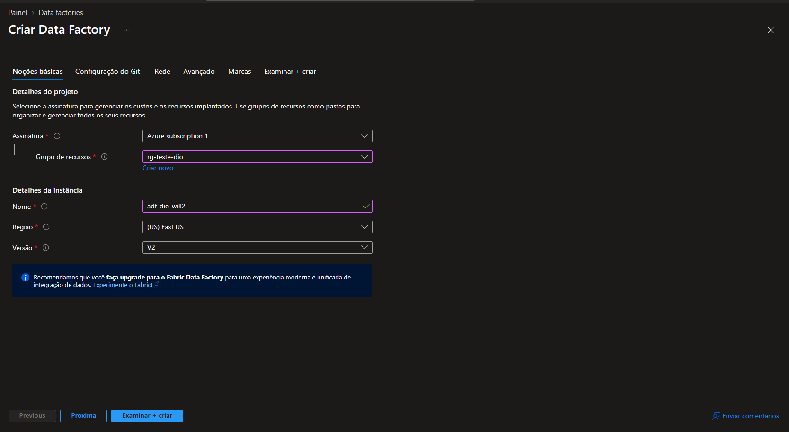
*Figura 1 — Aba "Noções básicas" na criação do Data Factory.*

### 1.1 Configuração do Git

Na aba "Configuração do Git" já é possível conectar a Factory a um repositório no momento da criação. Há um checkbox **"Configurar o Git depois"**: se ficar desmarcado, o próprio assistente pede os dados do repositório nessa tela — tipo de repositório (Azure DevOps ou GitHub), conta, nome do projeto, nome do repositório, branch e pasta raiz.

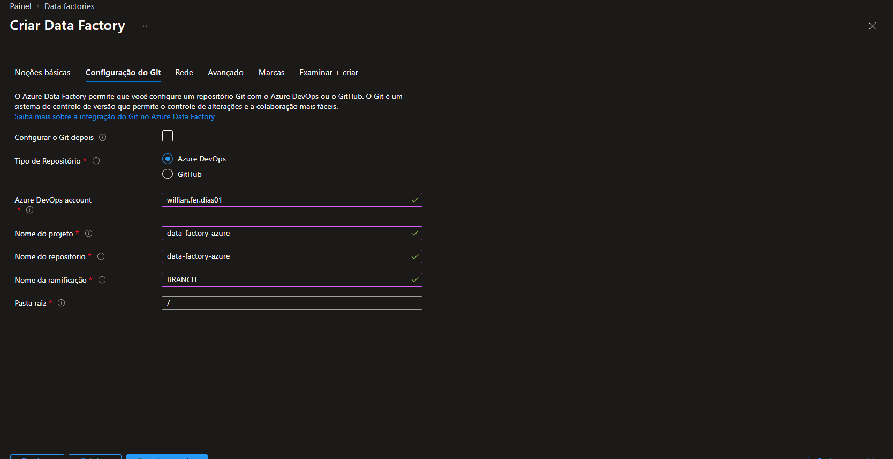
*Figura 2 — Vinculando o repositório Git já na criação da Factory.*

### 1.2 Rede

A aba "Rede" define como o runtime de integração vai se conectar ao serviço. Por padrão, o **Azure Integration Runtime** é provisionado automaticamente (`AutoResolveIntegrationRuntime`). Se o projeto precisar de um runtime auto-hospedado (por exemplo, para acessar dados on-premises), é aqui que se escolhe se a conexão será por endpoint público ou privado.

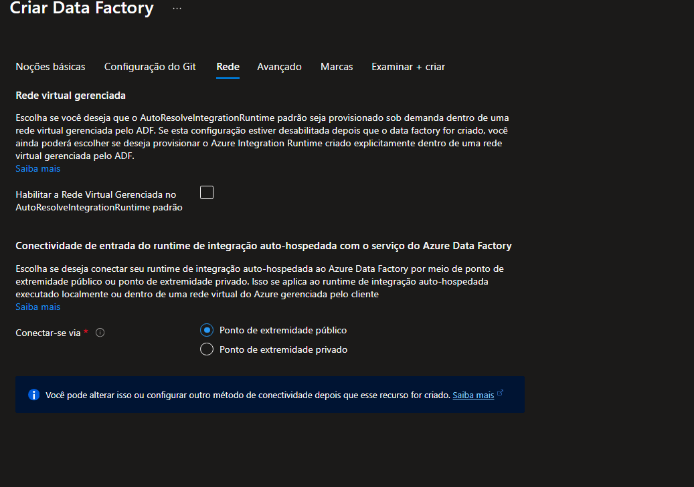
*Figura 3 — Configurações de rede e conectividade do runtime de integração.*

### 1.3 Marcas (Tags)

As tags são pares nome/valor usadas para classificar e organizar recursos dentro da assinatura. São úteis para filtrar custos e recursos por marca (ex.: `dio: azure` identifica que o Data Factory pertence ao bootcamp).

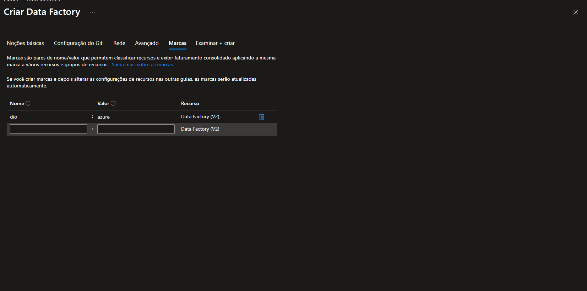
*Figura 4 — Aba "Marcas" para organizar e classificar o recurso.*

### 1.4 Revisão final

A aba "Examinar + criar" resume todas as escolhas feitas: assinatura, grupo de recursos, nome, região, versão, tipo de conexão de rede e tags aplicadas. É o checkpoint ideal antes de confirmar a criação.

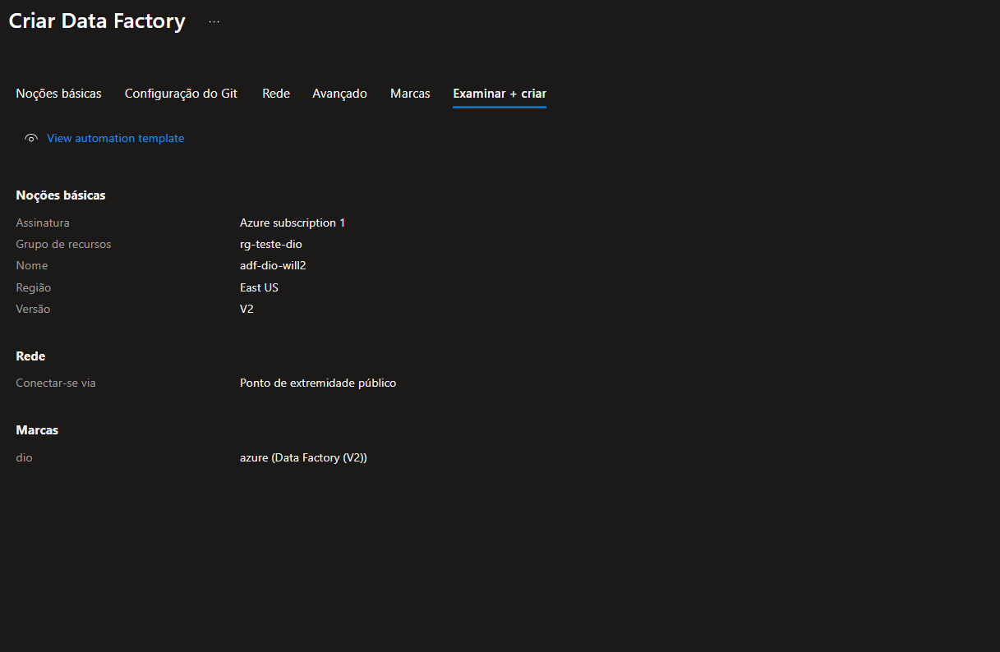
*Figura 5 — Revisão de todas as configurações antes da criação.*

---

## 2. Conectando o repositório dentro do Data Factory

Se o Git não foi configurado na criação, isso pode ser feito depois, dentro do **Data Factory Studio**, em **Gerenciar > Controle do código-fonte > Configuração do Git**. Quando não há conexão, o painel mostra "Nenhum repositório Git configurado" e o botão **Configurar** inicia o processo.

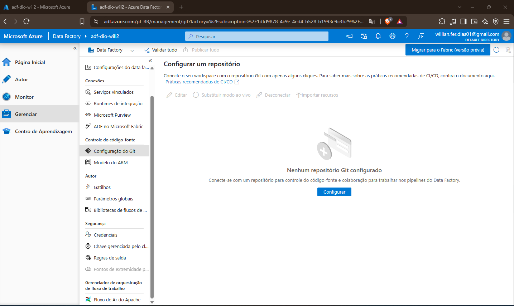
*Figura 6 — Tela inicial de configuração do repositório, sem Git conectado.*

**Passos da vinculação:**

1. Escolher o tipo de repositório (ex.: GitHub).
2. Autorizar o aplicativo **Azure Data Factory OAuth** a acessar a conta do GitHub.
3. Informar o proprietário e o repositório (ex.: repositório `data-factory-azure`).

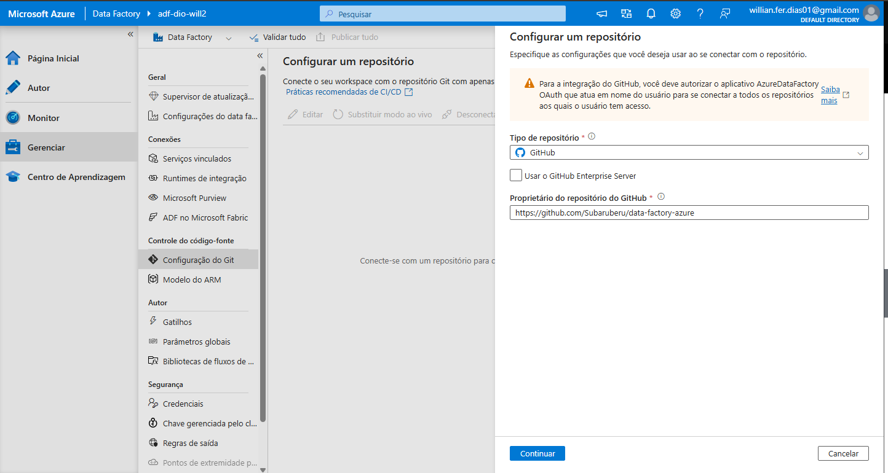
*Figura 7 — Seleção do tipo de repositório (GitHub) e autorização do OAuth.*

4. Com **"Usar o link do repositório"** selecionado, definir:
   - **Link do repositório Git** — URL completa do repositório no GitHub
   - **Branch de colaboração** — branch onde o time trabalha e salva alterações (ex.: `teste-1`)
   - **Branch de publicação** — branch técnica gerada para os artefatos de deploy (`adf_publish`, criada automaticamente)
   - **Pasta raiz** — local dentro do repositório onde os arquivos da Factory serão salvos (`/` = raiz)
   - **Importar recursos existentes** — traz para o repositório a configuração que já existia na Factory antes da conexão, evitando perda de dados

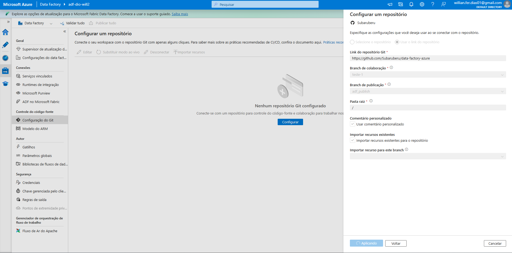
*Figura 8 — Detalhes da conexão: branches, pasta raiz e importação de recursos.*

Com a conexão concluída, o painel passa a exibir o resumo da integração ativa (repositório, conta, branches, pasta raiz, hash do último commit publicado). A partir daí, **toda alteração salva na Factory gera um commit automático** na branch de colaboração.

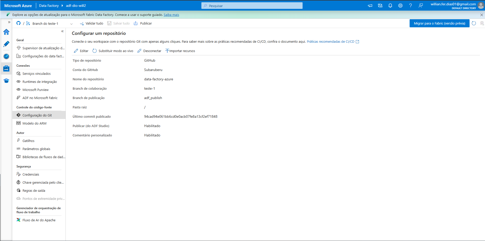
*Figura 9 — Repositório conectado com sucesso; resumo da configuração.*

---

## 3. Criando e publicando um pipeline

Com o versionamento ativo, os pipelines podem ser construídos normalmente pelo Data Factory Studio.

**Exemplo:** um pipeline (`pipeline1`) combinando:
- **Copy data** — move dados entre origem e destino
- **Notebook** (Synapse) — roda processamento adicional

Ao clicar em **Salvar tudo**, o Data Factory confirma o salvamento e gera automaticamente um commit na branch de colaboração conectada ao repositório.

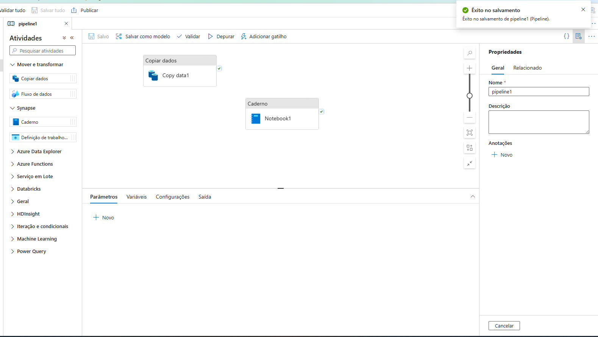
*Figura 10 — Pipeline com atividades de cópia de dados e notebook, salvo com sucesso.*

**No GitHub**, o resultado aparece com:
- Pasta `factory/` — metadados da Factory
- Pasta `pipeline/` — definição dos pipelines (ex.: `pipeline1`)
- Arquivos `README.md` e `publish_config.json` — usados no processo de publicação

O histórico de commits confirma o versionamento: cada alteração no Studio vira um commit rastreável, com autor, mensagem e horário — garantindo backup e histórico completo do ambiente.

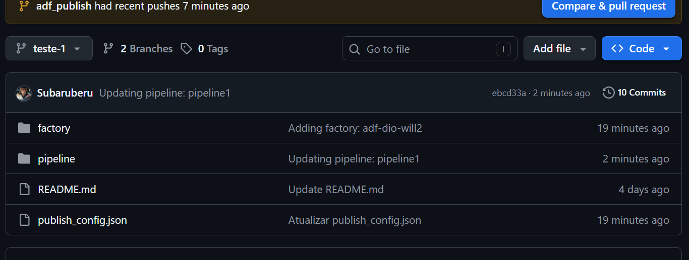
*Figura 11 — Repositório no GitHub com o histórico de commits do Data Factory.*

---

## Resumo

O fluxo completo cobre três frentes:

1. **Provisionar** o Data Factory já pensando em rede, tags e organização.
2. **Conectar** o Data Factory a um repositório Git (na criação ou depois), o que passa a versionar automaticamente toda alteração feita no Studio.
3. **Desenvolver** os pipelines normalmente — cada *Save* gera um commit e cada *Publish* consolida as mudanças na branch de publicação, funcionando como um backup vivo e auditável de todo o ambiente.
